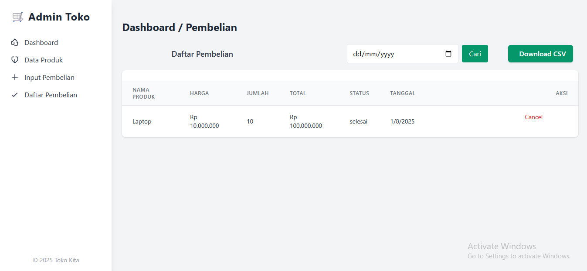

# Admin Toko

Aplikasi manajemen toko berbasis web untuk mempermudah pengelolaan data produk, pembelian, dan laporan.

---

## Link Chatbot
https://github.com/Fahriansyahh/chatbot


## Soal 

Buat sistem sederhana admin page untuk input data pembelian, cancel pembelian oleh admin toko.
Dengan database berikut
‎- DATABASE Produk (buat 10 produk)
‎- DATABASE Stock produk
‎- DATABASE Pembelian
‎
‎dengan menggunakan:
‎- Nodejs, express. js (EJS)
‎- database sql
‎- desain UI bebas

‎Ketentuan pengerjaan:
‎- Durasi pengerjaan 24 jam sejak arahan pretest dikirim di email
‎- Upload file hasil tes ke Github dan berikan link repositori kedua tes tsb (beri nama file dan panduan penggunaan file anda)

## Cara Penggunaan

### Persyaratan

Pastikan Anda telah menginstal **Node.js versi 22.17.1** dan **MySQL** di komputer Anda.

### Instalasi

1.  Clone repositori ini:
    ```bash
    git clone https://github.com/Fahriansyahh/InventarisBarang.git
    cd LATIHAN4
    ```

2.  Instal dependensi yang diperlukan:
    ```bash
    npm install
    ```

3.  Jalankan aplikasi:
    ```bash
    npm run start
    ```

### Konfigurasi Database

Aplikasi ini menggunakan database **MySQL**. Anda perlu import database yang sudah di sediakan
---

## Fitur Utama

### Tampilan Dashboard


### Manajemen Produk
Kelola data produk Anda, termasuk menambah, mengedit, dan menghapus produk.


### Pembelian
Catat setiap transaksi pembelian yang terjadi.


### Laporan
Buat dan unduh laporan penjualan untuk analisis bisnis.


---

## Desain Sistem

### Entity-Relationship Diagram (ERD)


### Use Case Diagram


---

## White-box Testing (Uji Coba White-box)

Berikut adalah beberapa skenario pengujian internal untuk memastikan fungsionalitas inti aplikasi berjalan dengan benar.

### CRUD (Create, Read, Update, Delete)
* **Input Data Berhasil:** Sistem berhasil menambahkan data barang baru ke database.
* **Nama Barang Tidak Boleh Sama:** Sistem berhasil menolak permintaan penambahan barang jika nama barang sudah ada di database, memastikan tidak ada duplikasi.
* **Hapus Barang:** Ketika barang dihapus, sistem berhasil menghapus data terkait dari tabel `stok` dan `pembelian` yang memiliki relasi dengan barang tersebut (menggunakan `CASCADE DELETE` atau logika aplikasi).

### Pembelian
* **Input Pembelian Berhasil:** Transaksi pembelian berhasil dicatat. Setelah transaksi berhasil, stok barang yang dibeli berhasil bertambah sesuai jumlah pembelian.
* **Pembatalan Pembelian Berhasil:** Pengguna berhasil membatalkan transaksi pembelian. Setelah pembatalan, stok barang yang terkait berhasil berkurang, kembali ke jumlah stok semula.

### Laporan dan Dashboard
* **Tampilan Dashboard Berhasil:** Dashboard berhasil menampilkan semua informasi yang relevan, seperti ringkasan penjualan, stok terlaris, dan data penting lainnya.
* **Download Laporan Berhasil:** Pengguna berhasil mengunduh laporan penjualan dalam format csv dengan data yang akurat.
